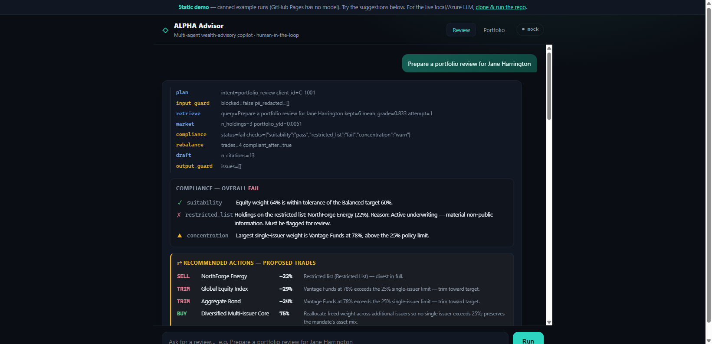
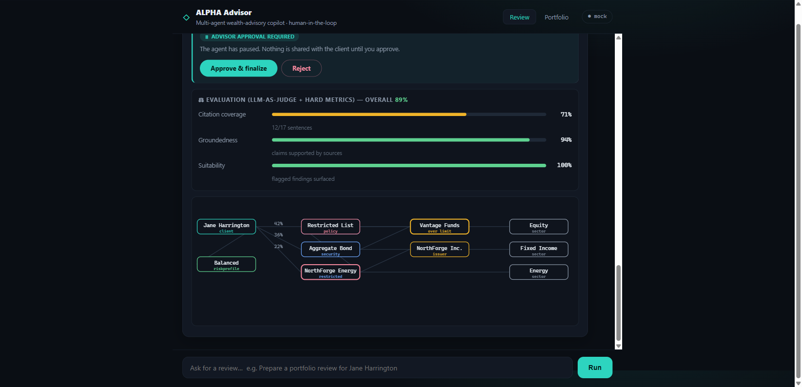
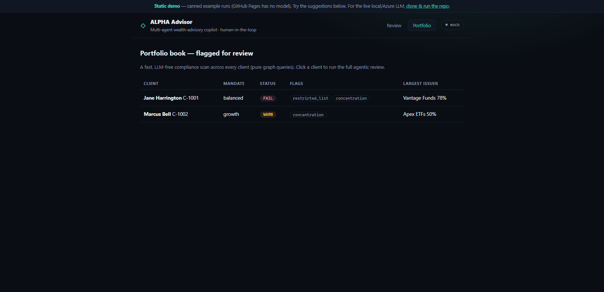

# ALPHA Advisor

**A multi-agent wealth-advisory copilot for regulated wealth management** — agentic RAG over
documents **and** a knowledge graph, with governance, compliance, a real human-in-the-loop
approval gate, proposed rebalancing trades, self-evaluation, and a tamper-evident audit trail.
Built on **LangGraph**.

> **▶ Live demo:** **https://aptsalt.github.io/alpha-advisor/** &nbsp;·&nbsp;
> **🎬 90-sec walkthrough:** [docs/alpha-advisor-demo.mp4](docs/alpha-advisor-demo.mp4) &nbsp;·&nbsp;
> **📘 Study guide:** [docs/study-guide.html](docs/study-guide.html)
>
> _The hosted demo replays canned example runs (GitHub Pages has no model). Clone and run for
> the live LLM on local Ollama or Azure OpenAI — see [Run it](#run-it)._



An advisor asks for a review; the system **plans** the work, runs **agentic RAG** over policy
documents and a client knowledge graph, calls **market-data tools**, runs **compliance checks**,
**proposes rebalancing trades** to fix any breach, drafts a **fully cited briefing**, scores its
own output, and **pauses for advisor approval** before finalizing — logging every step to a
hash-chained audit trail.

---

## Why it exists — and how it maps to the role

Built as a working reference implementation for an **Agentic AI / Agentic RAG Engineer** role on
an **ALPHA Wealth AI Platform** initiative — *autonomous reasoning, multi-agent collaboration, tool
integration, and intelligent workflow execution within regulated wealth management.* Every line of
that posting is a feature you can click:

| Requirement | Where it lives in this repo |
|---|---|
| **Agentic AI / Agentic RAG** | `nodes/retrieve.py` — retrieval that **grades its own results** and **rewrites + retries** on weak evidence; not one-shot RAG |
| **LangGraph** (or AutoGen / CrewAI / Semantic Kernel) | `graph.py` — `StateGraph`, conditional edges, `interrupt()`, checkpointer. Same flow in the other 3 frameworks: [docs/frameworks.md](docs/frameworks.md) |
| **Strong Python** | typed `AdvisorState`, pure-ish node functions, provider abstraction, `lru_cache`d corpus |
| **RAG architectures + vector databases** | `rag/vectorstore.py` — embed + cosine top-k behind a swappable `VectorStore` interface (Chroma / PGVector / Azure AI Search) |
| **Graph RAG + knowledge graphs** | `rag/graphrag.py` — `client→holding→issuer→sector` graph; multi-hop concentration / restricted-list queries vectors can't answer |
| **APIs / enterprise tools** | `nodes/market.py` — market data modelled as a **tool call**, not model free-text |
| **AI governance, guardrails, explainability, compliance** | `nodes/guardrails.py` (PII redaction, policy block), `nodes/compliance.py` (suitability / restricted / concentration), citations on every claim, `evaluate.py` (LLM-as-judge) |
| **Human-in-the-loop + auditability** | `nodes/approval.py` (`interrupt()` + `Command(resume=…)`), `audit.py` (hash-chained JSONL + `verify()`) |
| **Scalable cloud deployment** | stateless graph + durable checkpointer → Azure Container Apps; OpenTelemetry tracing. [docs/deployment.md](docs/deployment.md) |
| **Azure OpenAI · knowledge graphs · enterprise GenAI** | `ALPHA_PROVIDER=azure`; Neo4j adapter (`rag/neo4j_adapter.py`); Postgres checkpointer |
| **Wealth-management domain** | synthetic IPS / suitability / restricted-list policies, client portfolios, market data |

---

## What you can do (features)

| | |
|---|---|
|  | **Agentic review** — live streamed trace, compliance findings, **proposed rebalancing trades**, and a cited briefing. |
|  | **Self-evaluation + graph viz** — LLM-as-judge scores (groundedness, suitability, citation coverage) and the client's knowledge graph (restricted = red, over-limit = amber). |
|  | **Portfolio dashboard** — a fast, LLM-free book-wide compliance scan; the flagged-for-review queue. |
|  | **Human-in-the-loop** — the agent pauses on a real LangGraph `interrupt()`; the advisor approves or rejects; the run resumes and the audit chain is verified. |

- **Agentic RAG** — the retriever grades each document and rewrites/retries on weak evidence.
- **Graph RAG** — a `client→holding→issuer→sector` knowledge graph answers multi-hop questions
  (e.g. a **78% issuer concentration aggregated across two funds** — invisible to vector search).
- **Rebalancing** — computes specific trades (divest restricted, trim over-concentrated issuers,
  reallocate to a diversified core) that bring the book back within policy. Numbers are computed,
  never generated.
- **Governance** — PII redaction before the model, a hard policy gate (prohibited requests never
  reach client data), citation-grounded output, an advice disclaimer.
- **Self-evaluation** — an LLM-as-judge scores **groundedness** and **suitability**, plus a
  deterministic **citation-coverage** metric. Offline scorecard: `python run_eval.py`.
- **Human-in-the-loop** — a real `interrupt()` persists the run; the advisor approves/rejects;
  any replica can resume it (durable checkpointer).
- **Tamper-evident audit** — append-only, hash-chained JSONL with `verify()`.
- **Token-level streaming** — the briefing types out live over SSE.
- **Provider-portable** — `mock` (no keys) · `ollama` (local) · `azure` (production) — same graph.

---

## The orchestration graph

```
 START → plan → input_guard ──blocked──▶ refuse ▶ END
                    │ ok
                    ▼
              retrieve ⇄ rewrite      (agentic RAG: grade → retry)
                    ▼
                 market               (tool: market data)
                    ▼
               compliance             (suitability · restricted · concentration)
                    ▼
               rebalance              (proposed trades to fix breaches)
                    ▼
                 draft                (cited briefing, streamed)
                    ▼
              output_guard            (citations · PII · disclaimer)
                    ▼
               approval  ⏸  interrupt() → advisor approves / rejects
                    ├─ approved ▶ finalize ▶ END
                    └─ rejected ▶ discard  ▶ END

 every node writes a hash-chained audit record · one OpenTelemetry span
```

Full walkthrough + design rationale: [docs/architecture.md](docs/architecture.md).

---

## Run it

Default `ALPHA_PROVIDER=mock` runs the whole graph with **no keys and no network**.

```bash
python -m venv .venv && .venv/Scripts/pip install -r requirements.txt      # Windows
# (macOS/Linux: source .venv/bin/activate && pip install -r requirements.txt)

# CLI
python run.py "Prepare a portfolio review for Jane Harrington" --approve
python run.py "Can you guarantee 20% returns?"          # → refused by policy

# Web UI + API  → open http://localhost:8200
PYTHONPATH=src uvicorn alpha.api:app --port 8200

# Evaluation harness (scorecard → eval-report.json)
python run_eval.py

# Tests (6 end-to-end, mock mode)
python tests/test_smoke.py
```

**Live local model (Ollama):** `set ALPHA_PROVIDER=ollama` — routes high-frequency grading to a
small fast model (`qwen2.5:3b`) and drafting to a stronger one (`gemma3:12b`), with
`nomic-embed-text` for retrieval. **Azure OpenAI:** `set ALPHA_PROVIDER=azure` + the `AZURE_*` vars
in `.env.example` — nothing else changes.

### API

```bash
curl -s -X POST localhost:8200/api/review/stream  -d '{"request":"review Jane Harrington"}' -H "Content-Type: application/json"
curl -s -X POST localhost:8200/api/review/run-1/decision -d '{"decision":"approved"}' -H "Content-Type: application/json"
curl -s        localhost:8200/api/portfolio/scan
curl -s        localhost:8200/api/graph/C-1001
```

---

## Deploy

- **Free, one-click (live LLM-less / mock):** [`render.yaml`](render.yaml) →
  [](https://render.com/deploy?repo=https://github.com/aptsalt/alpha-advisor)
- **Static demo (this repo's GitHub Pages):** `docs/` — the real UI replaying canned runs.
- **Azure production:** Container Apps + Azure OpenAI + Postgres checkpointer + Neo4j +
  OpenTelemetry → Azure Monitor. [docs/deployment.md](docs/deployment.md).

---

## Layout

```
run.py                     CLI (runs to the interrupt, takes a decision, resumes)
run_eval.py                offline LLM-as-judge scorecard
src/alpha/
  graph.py                 the LangGraph spine
  state.py  llm.py  config.py  audit.py  corpus.py  evaluate.py  advice.py  telemetry.py  checkpoint.py  api.py
  nodes/                   plan · guardrails · retrieve · market · compliance · rebalance · draft · approval · finalize
  rag/                     vectorstore.py (numpy) · graphrag.py (networkx) · neo4j_adapter.py
  data/synth.py            synthetic clients, documents, knowledge graph
  web/index.html           single-page UI (served by the API)
tests/test_smoke.py        6 end-to-end tests
docs/                      architecture · frameworks · interview-qa · deployment · study-guide.html · static demo
```

## Docs

- [Architecture & JD mapping](docs/architecture.md) ·
  [Frameworks: LangGraph vs AutoGen vs CrewAI vs Semantic Kernel](docs/frameworks.md) ·
  [Deployment & scaling](docs/deployment.md) ·
  [Interview Q&A](docs/interview-qa.md) ·
  [Visual study guide](docs/study-guide.html)

---

*All data is synthetic — no real clients, holdings, or PII. The orchestration, guardrails, and
audit logic are the asset; the synthetic loaders and in-memory stores are swapped for real
connectors (custodian, CRM, Azure AI Search, Neo4j) in production.*
