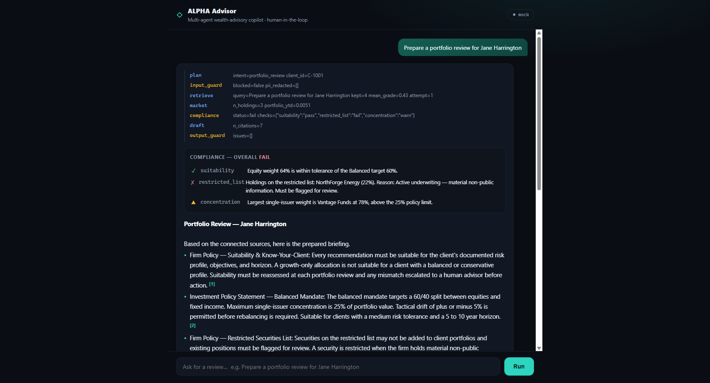
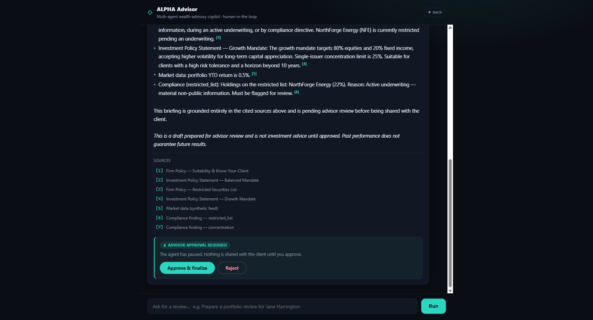

# ALPHA Advisor

A multi-agent **wealth-advisory copilot** that prepares a client portfolio review under
human supervision — agentic RAG over documents **and** a knowledge graph, with governance,
a real human-in-the-loop approval gate, and a tamper-evident audit trail. Built on
**LangGraph**.

> **▶ Live demo:** _add your Render URL here after deploying (see "Deploy" below)_ ·
> **Study guide:** [`docs/study-guide.html`](docs/study-guide.html) ·
> **Architecture:** [`docs/architecture.md`](docs/architecture.md)



An advisor asks for a review; the system plans the work, retrieves from policy documents
**and** a portfolio knowledge graph, calls a market-data tool, runs compliance checks,
drafts a **cited** briefing, then **pauses for advisor approval** before finalizing —
logging every step. Every line of the job posting maps to a working feature
→ [`docs/architecture.md`](docs/architecture.md).

| Approval gate (human-in-the-loop) | Run it |
|---|---|
|  | The agent pauses on a real LangGraph `interrupt()`; the advisor approves or rejects; the run resumes and finalizes — audit chain verified. |

## Run it (zero config, no keys)

```bash
python -m venv .venv && .venv/Scripts/pip install -r requirements.txt    # Windows
# (macOS/Linux: source .venv/bin/activate && pip install -r requirements.txt)

python run.py "Prepare a portfolio review for Jane Harrington" --approve
python run.py "review C-1002" --reject --note "rebalance first"
python run.py "Can you guarantee 20% returns?"          # → refused by policy
python run.py "review Jane Harrington"                  # interactive approval gate
```

Default `ALPHA_PROVIDER=mock` runs the full graph deterministically with no network.
Set `ALPHA_PROVIDER=ollama` to drive it with a local model (e.g. `qwen2.5-coder`), or
`ALPHA_PROVIDER=azure` for Azure OpenAI — the graph is identical across all three.

```bash
python tests/test_smoke.py        # 6 end-to-end tests, mock mode
```

## The web UI + API

```bash
PYTHONPATH=src uvicorn alpha.api:app --port 8200      # then open http://localhost:8200
```

A single-page UI (served by the API itself) shows the live agent trace, the compliance
findings, the cited briefing, and an **Approve / Reject** gate that drives the real
human-in-the-loop interrupt. The JSON API underneath:

```bash
curl -s -X POST localhost:8200/api/review -H "Content-Type: application/json" \
     -d '{"request":"review Jane Harrington"}'                       # → run_id + briefing
curl -s -X POST localhost:8200/api/review/run-1/decision -H "Content-Type: application/json" \
     -d '{"decision":"approved"}'                                    # → resume + finalize
```

The graph is stateless; paused runs live in the checkpointer (`InMemorySaver` locally,
Postgres in prod), so any replica can resume any run.

## Deploy (free, shareable)

This is a stateful agent (the approval gate pauses a real run), so it wants a **persistent
process** — [`render.yaml`](render.yaml) defines a free Render web service:

[](https://render.com/deploy?repo=https://github.com/aptsalt/alpha-advisor)

1. Click the button (or [render.com](https://render.com) → **New → Blueprint** → this repo).
   Sign in with GitHub, approve — Render reads `render.yaml` and deploys. You get a URL like
   `https://alpha-advisor.onrender.com`.
2. Put that URL in the **Live demo** line at the top of this README.
3. (optional) Set the repo variable `DEPLOY_URL` to that URL — the included GitHub Action
   pings it every 14 min so the free instance never cold-starts for a recruiter.

For the **Azure** production path (Container Apps + Azure OpenAI + Postgres checkpointer +
Neo4j + OpenTelemetry → Azure Monitor) see [`docs/deployment.md`](docs/deployment.md).
Turn on per-node tracing anywhere with `ALPHA_TRACING=1`.

## What you'll see

```
[plan] → [input_guard] → [retrieve ⇄ rewrite] → [market] → [compliance]
       → [draft] → [output_guard] → [approval (interrupt)] → [finalize | discard]
```

On a real run the compliance node flags that the sample client holds a **restricted-list**
security and is **over the single-issuer concentration limit** — findings that require a
multi-hop graph query, not vector similarity — then pauses for the advisor.

## Why it's built this way

- **Agentic RAG, not naive RAG** — retrieval grades its own results and rewrites+retries on
  weak evidence (`src/alpha/nodes/retrieve.py`).
- **Vectors + a knowledge graph** — prose via a vector store, portfolio structure via a
  `client→holding→issuer→sector` graph (`src/alpha/rag/`).
- **Governance on both ends** — PII redaction + policy block in, citation/PII/disclaimer
  checks out, three compliance checks with reasons (`src/alpha/nodes/guardrails.py`, `compliance.py`).
- **Real human-in-the-loop** — LangGraph `interrupt()` + `Command(resume=...)` (`approval.py`).
- **Tamper-evident audit** — append-only, hash-chained JSONL with `verify()` (`src/alpha/audit.py`).
- **Provider-portable** — mock / Ollama / Azure OpenAI by config; runs fully on-prem.

## Layout

```
run.py                     CLI driver (runs to the interrupt, takes a decision, resumes)
src/alpha/
  graph.py                 the LangGraph spine
  state.py                 typed shared state
  llm.py                   mock | ollama | azure providers (chat + embed)
  config.py  audit.py  corpus.py
  nodes/                   plan · guardrails · retrieve · market · compliance · draft · approval · finalize
  rag/                     vectorstore.py (numpy) · graphrag.py (networkx)
  data/synth.py            synthetic clients, documents, knowledge graph
tests/test_smoke.py        6 end-to-end tests
docs/                      architecture.md · frameworks.md · interview-qa.md
```

## Docs

- [`docs/architecture.md`](docs/architecture.md) — the graph + JD→feature mapping + design rationale
- [`docs/frameworks.md`](docs/frameworks.md) — LangGraph vs AutoGen vs CrewAI vs Semantic Kernel; production hardening
- [`docs/interview-qa.md`](docs/interview-qa.md) — senior-level Q&A anchored to this code

---

*All data is synthetic. No real clients, holdings, or PII. The orchestration, guardrails,
and audit logic are the asset; the synthetic loaders and in-memory stores are swapped for
real connectors (custodian, CRM, Azure AI Search, Neo4j) in production.*
